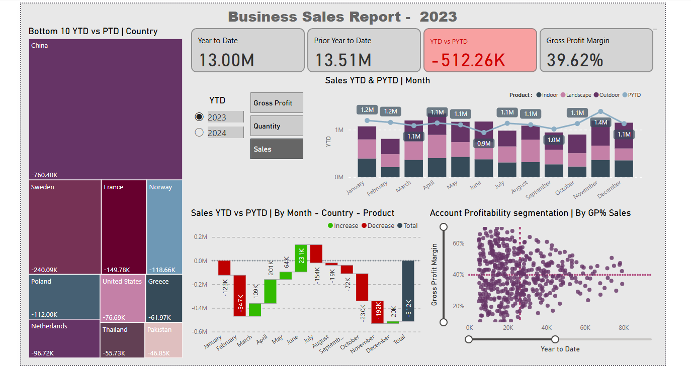
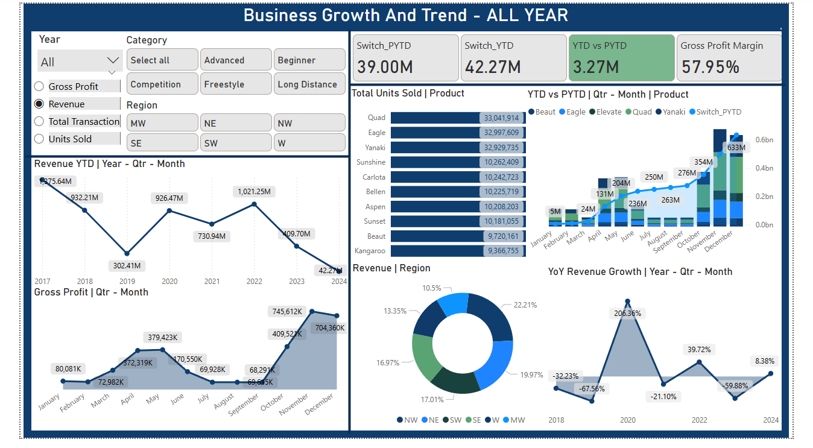
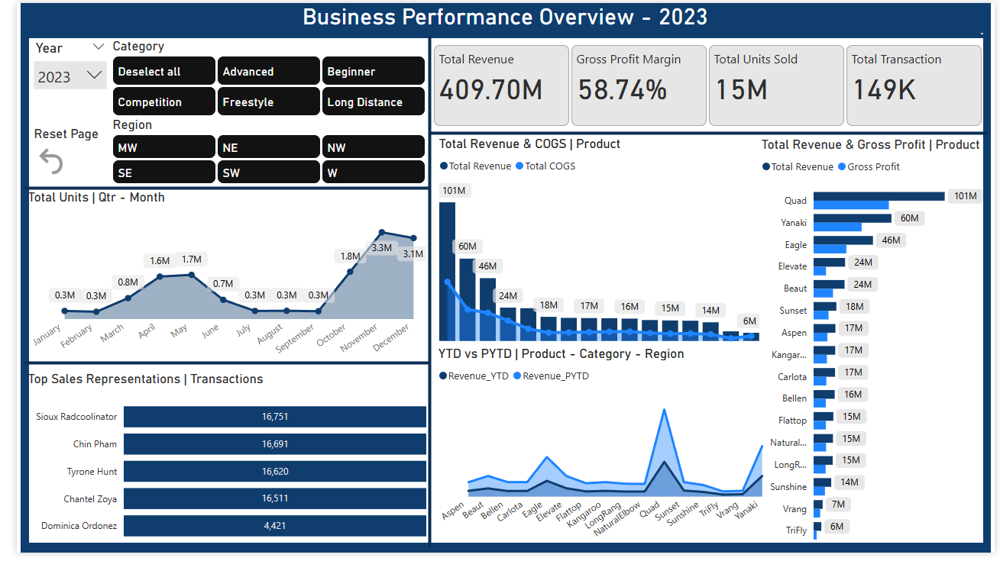

# 📊 Boomerang & Plant Dashboard

This repository presents a **snapshot** of an interactive Power BI dashboard designed to analyze and monitor **business sales performance** throughout the year. The dashboard covers key metrics such as:

- Year-to-Date (YTD) vs Prior Year-to-Date (PYTD) Sales  
- Gross Profit Margin  
- Monthly Sales Trends  
- Product Performance  
- And more  

---

## 🖼️ Snapshot Preview

> ⚠️ The image below is a **static snapshot** of the full dynamic dashboard.

This snapshot provides a **visual overview** of the dashboard's layout, structure, and analytical insights. Please note that the **interactive features** such as slicers, tooltips, and drill-downs are not visible in this image.

---

## 📁 Project Components

Due to file size and GitHub limitations, the **full Power BI project files (.pbix)** and underlying datasets are **not hosted directly on GitHub**. However, the repository includes supporting materials:

- `/images` – Contains the snapshot image of the dashboard.  
- `/Boomerang` – Contains the Power BI file for the Boomerang report.  
- `/Plant` – Contains the Power BI file for the Plant report.  

---

## 📌 About the Snapshot

This snapshot was taken from a live, fully interactive Power BI dashboard. It provides a high-level glance into:

- Sales trends and year-over-year comparisons  
- Market performance by country or region  
- Product-level analysis  
- Profitability segmentation  
- And more  

If you're interested in exploring the full dashboards, please download the corresponding `.pbix` files from the folders above.

---
